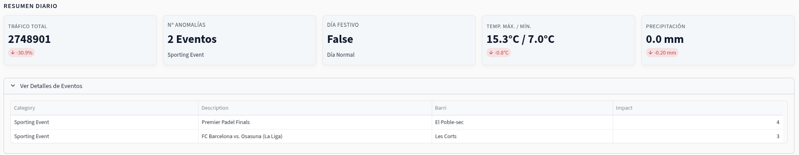
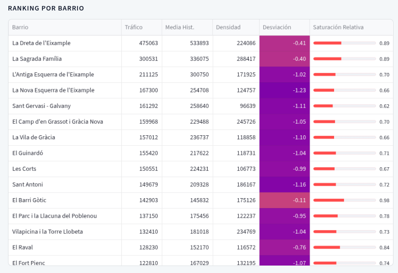
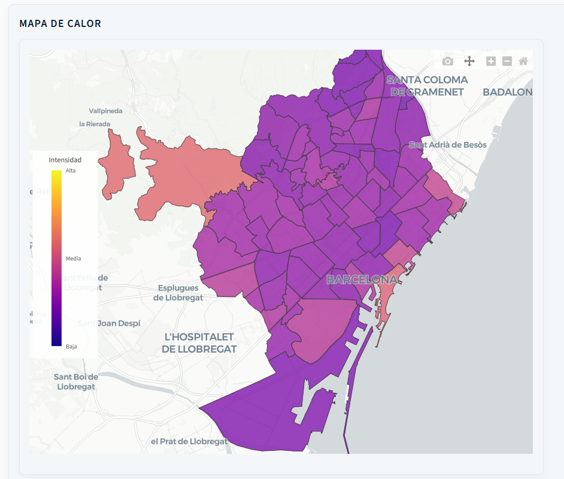
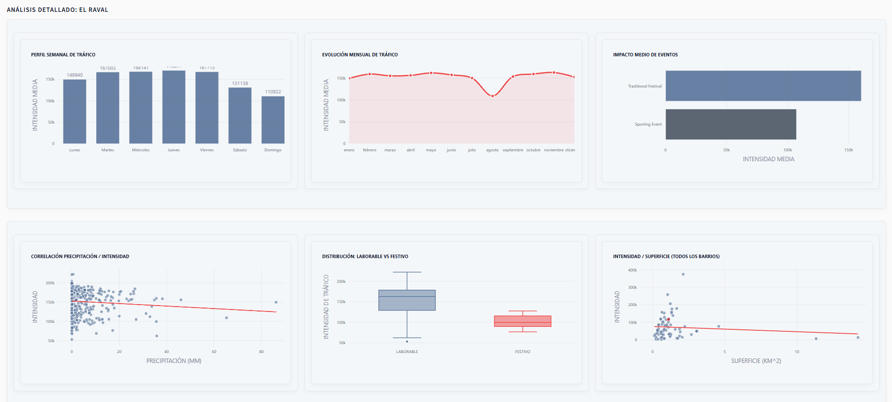
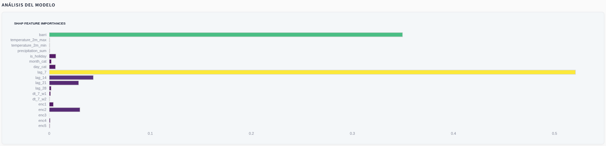
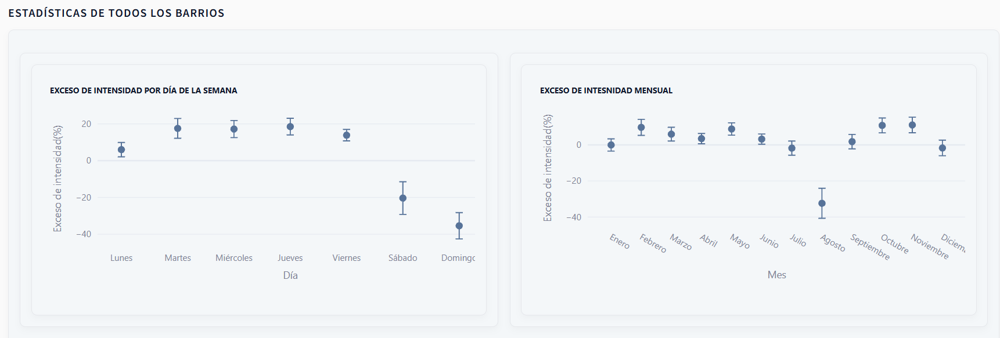

<p align="center">
  
</p>

## Mobility peak prediction in Barcelona

The GoMotion project consists of a mobility peak prediction system which uses historical data (provided by _Telefónica_) combined with public data (such as meteo data and event websites). It implements predictive models to anticipate increased flux in order to ultimately improve the local infrastructure.

Para la versión en español de este readme, ir <a href="README.md">aquí</a>.

## Important

- GoMotion has been created with the purpose of predicting mobility trends, detecting peaks and understanding their origin. The lack of accurate and significant data about public transport in Barcelona makes the task of improving it a lot more challenging. However, we have built a model capable of anticipating peaks which, complemented with quality data, can offer important insight and be a useful tool in the development of the public transport network.
- We have created a mathematical framework (seen in `mathematical_model.pdf`) with the aim of providing a solid foundation to our work and extracting useful measures from the provided data.
- The prediction window of the software is of 7 days. A complete implementation of the program requires a daily updating of the data. Since this is not possible with the data provided by _Telefónica_, the program fills in the data from the last day given until the current one using the prediction model. This has a detrimental effect on the quality of predictions, as tiny errors made in a prediction due to a small bias in the model will propagate to the present and be heavily amplified.

## Requirements
- Python 3.12+
- Internet connection
- Access to the `output_limite_legal` folder, provided by _Telefónica_ (if this is not possible, sample data can be generated using `example_data.py`)
- Access to `barris.csv`, `events.csv` and `holidays.csv` (located in the data folder)
- A Google Gemini API key

## Installation
In order to use GoMotion, it is recommended to create a virtual environment, and required to download the necessary libraries.

1) Create the virtual environment from the **root folder**:
`python -m venv .venv`
2) Activate the virtual environment:
- MacOS / Linux: `source .venv/bin/activate`
- Windows PowerShell / Windows Cmd: `.venv\Scripts\Activate.ps1` / `.venv\Scripts\activate`
3) Download libraries:
`pip install -r requirements.txt`
4) Add API key in `.env`:
`GEMINI_API_KEY="key"`
- Note: depending on the Gemini API tier the user has, there is a chance that excessive rebuilding of the project exceed the daily requests limit.


## File structure

```
GoMotion/
├── data/                   
│   ├── output_limite_legal # Data provided by Telefónica
|   └── barris.csv          # OpenData BCN public data
│   └── events.csv          # Event data
|   └── holidays.csv        # Holiday data
│
├── media/               
|    └── analysis.png   
│    └── GoMotionLogo.png    
|    └── GoMotionShortLogo.png  
|    └── GoMotionShortLogo.ico 
|    └── barri_list.png
|    └── daily_metrics.png
|    └── general_stats.png
|    └── heatmap.png
|    └── model_analysis.png
│
├── stats/   
|   ├── stats/                  
|   |     └── statistics_day_of_the_week.py # Average intensity excess by day of the week
|   |     └── statistics_month.py           # Average intensity excess by month of the year
|   |                
│   ├── llm_scraper.py      # Event and holiday extraction
│   └── barri_manager.py    # Creation of the graph representing Barcelona
|   └── metadata_manager.py # Metadata
|   └── stats.py            # Useful statistics
|   └── xgb_model.py        # Definition of XGBoost model
|   └── event_encoder       # Event encoding
|   └── hyperparameter_optimizer.py # Training and optimization of model
|   └── peak_classifier.py  # Peak definition and classification
|   └── data_filler.py      # Fill data up until the provided date. Also used for predicting
|   └── meteo.py            # Get meteo data
|   └── intensities.py      # Intensity computation (see paper for more information)
|   └── pipeline.py         # Pipeline, main project file
|   └── dashboard.py        # Streamlit display
|   └── example_data.py     # Sample data generation
│
├── .env                    # Environment variables
└── requirements.txt        # Dependencies
└── mathematical_model.pdf  # Mathematical framework
```

## Running the program
It is enough to run the pipeline in order to access all features. From the **root folder** of the project, MacOS / Linux: `python3 src/pipeline.py`, Windows Cmd: `python src/pipeline.py`.
- If the user does not have the `output_limite_legal` folder, `src/example_data.py` must be run previously.
- Note: It is expected that the first time `pipeline.py` runs for some minutes until the dashboard appears. There is a somewhat heavy computational process that needs to happen in order to obtain the data that needs to be shown. Nevertheless, future execution is significantly faster, as it only updates new information

## 1. Data Preparation

### 1.1. Data Cleaning and Organization
Once the neighborhood mobility data provided by Telefónica has been downloaded, we will remove columns irrelevant to our project and retain only the following columns: `day`, `barrio_origen_name`, `barrio_destino_name`, and `viajes`. 

We will use the resulting dataset and the model explained in the attached pdf to create a new dataset with the following columns: `day`, `barri` (neighborhood), and `intensity`.  
These functions are implemented in the `barri_manager.py` and `intensities.py` files.

### 1.2. Events, Holidays, and meteo files
To improve our model's precision, we will use historical data on events, holidays, and weather.  
The event and holiday files have been manually collected and are located in `data/events.csv` and `data/holidays.csv`, respectively.  
Each event has an associated date, a category, a list of neighborhoods where it takes place, and an impact (from 1 to 5) relative to its category. Holidays only have an associated date.

To collect meteorological data, we will use the `OpenMeteo` API within the `meteo.py` file. For simplicity, and because we believe it is best for the model, we will only collect the rainfall level and the maximum and minimum temperatures for each day.

#### 1.2.1. Selected Events
Also for simplicity, and because it is practically impossible to track every event in a city as active as Barcelona, we have selected the events we believe are most relevant for our analysis. Specifically:  
- Olympic Stadium events
- FC Barcelona home matches
- Music festivals: Primavera Sound, Cruïlla, and Sónar
- Running events: Cursa del Corte Inglés and Zurich Marató de Barcelona
- Fira de Barcelona events
- Popular Festivals: Sant Jordi, La Diada, and La Mercè

### 1.3. Metadata
Throughout the use of the program, there is information that needs to be shared between various files and sessions that does not correspond to data per se. We call this information metadata, and we store it in `data/metadata.py` (an automatically created file). It is not advisable to manually modify the metadata, as unexpected behaviors may occur.

### 1.4. Dot-env
This project makes use of the Google Gemini API. Its usage is subject to the possession of a key that must be stored in a `.env` file in the same directory as the other folders.

## 2. Mobility Peak Prediction

GoMotion is capable of predicting intensities for each neighborhood 7 days in advance.

### 2.1. Future Meteorological Data
In the same way as for the historical meteorological data, we will use the `OpenMeteo` API (in `meteo.py`) to obtain temperature and rain forecasts for the following week.

### 2.2. Future Holiday and Event Data
To identify events and holidays for the following week, we have created a **web-scraping** system. In `llm_scrapper.py`, we use `playwright` and `bs4` to obtain the text from the web pages of interest (mentioned in section [1.2.1](#121-selected-events)), and an LLM (`gemini`) that formats the events and holidays found to make them ready for model training.

### 2.3. Event Encoding
In order to extract the most important information and use it in our prediction model, we encode the events of a day in a neighborhood into a 5-dimensional latent space. To do this, we train 2 models: an encoder and a decoder. This architecture allows training a model using events as both *input* and *validation* simultaneously, as the decoder should act as an inverse function and bring the latent space vector back to the event space.

Once we have the trained model, we save the first half of the trained model in `models/encoder.keras`. Additionally, we encode events up to the necessary date (one week from the day the program is executed) using the encoder. The result is saved in `data/encoded_events.csv`.

### 2.4. Creation of Prediction Model
Data prediction will be done using an extreme gradient boosting (`XGBoost`) model, given that it is an architecture that:
- Allows for easy integration of categorical features.
- Has extensive documentation and usage.
- Is one of the most suitable for handling tabular data (all our data is structured in `.csv` files).

The model definition and the tools for its training and optimization are found in the `hyperparameter_optimizer.py` file.

Up next are listed the features used and their description:
| Feature | Type | Description |
| ------------- |-------------| -------------|
| barri | Categorical | Nombre del barrio |
| temperature_2m_max | Numerical | Maximum temperature for the day (ºC) |
| temperature_2m_min | Numerical | Minimum temperature for the day (ºC) |
| precipitation_sum | Numerical | Total rainfall (mm) for the day |
| is_holiday | Bool | If the day is a holiday, it takes value 1 |
| month_cat | Categorical | Month |
| day_cat | Categorical | Day of the week |
| lag_7 | Numerical | Intensity 7 days ago |
| lag_14 | Numerical | Intensity 14 days ago |
| lag_21 | Numerical | Intensity 21 days ago |
| lag_28 | Numerical | Intensity 28 days ago |
| dt_7_w1 | Numerical | Discrete derivative of the most recent week: (lag_7 - lag_14) / 7 |
| dt_7_w2 | Numerical | Discrete derivative of the second-most recent week: (lag_14 - lag_21) / 7 |
| enc1 | Numerical | 1st coordinate of event encoding for the specified day and neighborhood |
| enc2 | Numerical | 2nd coordinate of event encoding for the specified day and neighborhood |
| enc3 | Numerical | 3rd coordinate of event encoding for the specified day and neighborhood |
| enc4 | Numerical | 4th coordinate of event encoding for the specified day and neighborhood |
| enc5 | Numerical | 5th coordinate of event encoding for the specified day and neighborhood |

The file allows training the model across a variety of hyperparameters. To achieve this, it implements a custom *grid search*: given a collection of hyperparameter ranges, models are trained for all elements of their Cartesian product, and the one with the highest precision (evaluated based on prediction hits) is saved. The adjustable hyperparameters are:

- **Weight base:** the XGBoost model assigns weights to the errors of each sample based on its *z-score* using the following formula: $weight = max(1, base^{\text{z-score}})$. Increasing the *base* hyperparameter weights errors more heavily on days with excessive mobility.
- **Learning rate:** modifying the *learning rate* is allowed to vary the convergence rate and explore new minima. The special value `None` implements the following schedule:

| Cutoff round | Learning rate |
| :--- | :--- |
| 0 | 0.1 |
| 100 | 0.001 |
| 150 | 0.0001 |

- Tree depth: the tree depth can be modified as well (more info at https://xgboosting.com/configure-xgboost-max_depth-parameter/)

When the best model is selected, it gets stored in `models/regressor.joblib`.


## 3. Dashboard and Visualization

In order to better understand the predictions, we have implemented a dashboard using `streamlit`.

### 3.1. Data Loading
As soon as the dashboard is accessed, the `fill_data()` function, located in `data_filler.py`, will be called. This ensures we have the data and predictions for the days of interest.

### 3.2. Daily Metrics
We will have the option to select a date. Once selected, relevant metrics for that day will be shown: temperature, rain, events, holidays, and total traffic for the day. Additionally, we obtain a historical comparison of these values. Specifically:
* **Temperature and Rainfall:** Comparison with the average of the last 30 days.
* **Events:** Comparison with the average daily events over the last 30 days.
* **Total Traffic:** Comparison with the average of the last 4 days falling on the same day of the week (e.g., Sunday).



### 3.3. Neighborhood Table
For the selected day, a table will be displayed showing, for each neighborhood: its intensity, its historical average, its z-score, its density (intensity/area), and the type of peak we are facing (defined in `matematical_model.pdf` and `peak_classifier.py`).



### 3.4. Heatmap
Additionally, a heatmap of the intensities of each neighborhood will be displayed. These intensities are relative to the neighborhood; that is, a peak is considered to exist when the value deviates significantly from what is usual for that neighborhood. We can click on a specific neighborhood to select it.



### 3.5. Detailed Neighborhood Analysis
Once a neighborhood is selected on the map, we will obtain a series of graphs explaining how each variable affects the historical intensity of that neighborhood. Specifically:
* Holiday/Workday impact
* Impact of each event type
* Day of the week impact
* Month impact
* Precipitation impact



### 3.6. Model Analysis
We will find a detailed analysis of the model to gain a more general overview of which parameters most significantly affect mobility intensity in Barcelona. Additionally, we will be able to see the model's accuracy percentage for predicted peaks, the percentage of underestimated peaks, and the percentage of overestimated peaks.



### 3.7. Statistics for All Neighborhoods
Finally, the following statistics for all neighborhoods can be visualized: average intensity excess as a percentage by day of the week, and average intensity excess as a percentage by month of the year.



## Autores
- Javier Badesa Pérez
- Alexander Cameron Hall Parrilla
- Oscar Senesi Aladjem
- Dan Manuel Vancea Boros
